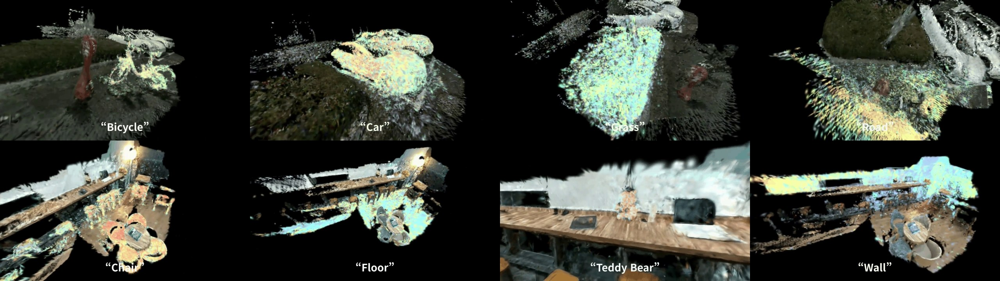
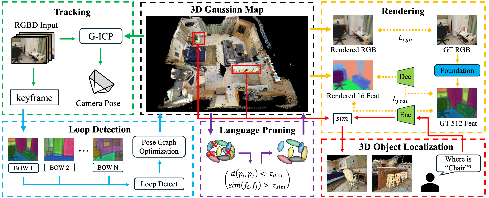

<p align="center">

  <h1 align="center">🧱 LEGO-SLAM: Language-Embedded Gaussian Optimization SLAM</h1>
  <!-- <h1 align="center">[ECCV 2026]</h1> -->
  <p align="center">
    <a href="https://sibaek-lee.github.io/"><strong>Sibaek Lee</strong></a>
    ·
    <a href="https://riboha.github.io/"><strong>Seongbo Ha</strong></a>
    ·
    <a href="https://sites.google.com/view/thithin/"><strong>Kyeongsu Kang</strong></a>
    ·
    <a href="https://joonyeolchoiskku.github.io/"><strong>Joonyeol Choi</strong></a>
    ·
    <a href="https://takseungjun.github.io/Taksume.github.io/"><strong>Seungjun Tak</strong></a>
    ·
    <a href="https://bogus2000.github.io/"><strong>Hyeonwoo Yu</strong></a>
  </p>


  <h3 align="center"><a href="https://arxiv.org/abs/2511.16144v1">Paper</a> | <a href="https://lab-of-ai-and-robotics.github.io/LEGO-SLAM/">Project Page</a>
  <div align="center"></div>
</p>

<p align="center">
  
</p>
<p align="center">
  LEGO-SLAM running at 15 FPS on a ScanNet scene with language-based loop closing for drift correction.
</p>

<br>

---

## Open-Vocabulary Querying
<p align="center">
  Text-query results on outdoor and indoor scenes captured with a Femto Mega camera and reconstructed by LEGO-SLAM.
</p>
<p align="center">
  
</p>

<br>

---

## Method Overview
<p align="center">
  
</p>

LEGO-SLAM is a 3DGS-based SLAM framework that supports open-vocabulary semantic querying and rendering. It tracks via G-ICP and efficiently builds a map by embedding Gaussians with scene-adaptive 16D language features. Map management is achieved through Language Pruning and Language-Based Loop Detection. The generated map enables open-vocabulary 3D Object Localization.

<br>

---

## Environments
Install requirements
```bash
conda create -n lego_slam python==3.9
conda activate lego_slam
conda install pytorch==2.0.0 torchvision==0.15.0 torchaudio==2.0.0 pytorch-cuda=11.8 -c pytorch -c nvidia
conda install lightning -c conda-forge
pip install --no-build-isolation -r requirements.txt
```
Also, PCL is needed for fast-gicp submodule.
```bash
sudo apt install libpcl-dev
```
Install submodules

```bash
conda activate lego_slam
pip install --no-build-isolation submodules/diff-gaussian-rasterization-feature

cd submodules/fast_gicp
mkdir build
cd build
cmake ..
make
sudo make install
cd ..
python setup.py install

# gtsam
conda install conda-forge::gtsam
```

<br>

---

## Datasets

### Download

```bash
# Replica & TUM-RGBD
bash download_replica.sh
bash download_tum.sh
```
For ScanNet, please follow the data downloading procedure on the [ScanNet](http://www.scan-net.org/) website, and extract color/depth frames from the `.sens` file using this [code](https://github.com/ScanNet/ScanNet/blob/master/SensReader/python/reader.py).

### Structure

<details>
  <summary>Replica (click to expand)</summary>

  ```
  Replica
  └── office0
          ├── images
          │   ├── frame000000.jpg
          │   ├── frame000001.jpg
          │   └── ...
          ├── depth_images
          │   ├── depth000000.png
          │   ├── depth000001.png
          │   └── ...
          ├── rgb_feature_langseg
          │   ├── frame000000.png_vis.png
          │   ├── frame000000_fmap_CxHxW.pt
          │   └── ...
          └── traj.txt
  ```
</details>

<details>
  <summary>TUM-RGBD (click to expand)</summary>

  ```
  TUM
  └── rgbd_dataset_freiburg1_desk
          ├── rgb
          │   ├── 1305031452.791720.png
          │   ├── 1305031452.823674.png
          │   └── ...
          ├── depth
          │   └── ...
          ├── rgb_feature_langseg
          │   ├── 1305031452.791720.png_vis.png
          │   ├── 1305031452.791720_fmap_CxHxW.pt
          │   └── ...
          ├── rgb.txt
          ├── depth.txt
          ├── groundtruth.txt
          └── accelerometer.txt
  ```
</details>

<details>
  <summary>ScanNet (click to expand)</summary>

  ```
  ScanNet
  └── scene0000_00
          ├── color
          │   ├── 000000.jpg
          │   ├── 000001.jpg
          │   └── ...
          ├── depth
          │   ├── 000000.png
          │   ├── 000001.png
          │   └── ...
          ├── pose
          │   ├── 000000.txt
          │   ├── 000001.txt
          │   └── ...
          ├── intrinsic
          │   ├── intrinsic_color.txt
          │   └── intrinsic_depth.txt
          ├── rgb_feature_langseg
          │   ├── 000000.jpg_vis.png
          │   ├── 000000_fmap_CxHxW.pt
          │   └── ...
          └── camera.txt
  ```

  We use the following sequences:
  ```
  scene0000_00
  scene0059_00
  scene0106_00
  scene0169_00
  scene0181_00
  scene0207_00
  ```
</details>

### LSeg Model
Download `demo_e200.ckpt` from [Google Drive](https://drive.google.com/file/d/1ayk6NXURI_vIPlym16f_RG3ffxBWHxvb/view?usp=sharing) and place it under `Lseg/`.

### Generating Semantic Features

We use LSeg by default, but any vision-language model that produces per-pixel features (e.g., SAM + CLIP) can be used as a drop-in replacement.

Before running LEGO SLAM, generate semantic features using `run_encoding.sh`:

```bash
bash run_encoding.sh --dataset_path <path> --scenes "<scene1> <scene2> ..." --rgb_dir <folder_name>
```

Examples:
```bash
# Replica
bash run_encoding.sh --dataset_path /path/to/Replica --scenes "office0 office1 room0" --rgb_dir images

# ScanNet
bash run_encoding.sh --dataset_path /path/to/Scannet --scenes "scene0000_00 scene0059_00" --rgb_dir color

# TUM
bash run_encoding.sh --dataset_path /path/to/TUM --scenes "rgbd_dataset_freiburg2_xyz" --rgb_dir rgb
```

This generates `rgb_feature_langseg/` with feature maps for each RGB image. Note that feature maps can be large; we recommend storing datasets on an SSD.

### Undistorting Feature Maps

For datasets with lens distortion (TUM, ScanNet), the generated feature maps must be undistorted before running SLAM. This step is **not needed for Replica** (zero distortion).

```bash
cd utils
bash undistort_feature.sh <TUM_PATH> <SCANNET_PATH>
```

Examples:
```bash
# Both TUM and ScanNet
bash undistort_feature.sh /path/to/TUM /path/to/Scannet
```

The script applies camera-specific undistortion to each `.pt` feature map in-place using `undistort_feature_img.py`.

<br>

---

## Running

```bash
bash run_replica.sh /path/to/Replica
bash run_tum.sh /path/to/TUM
bash run_scannet.sh /path/to/Scannet
```

The output `scene.ply` can be viewed in [SuperSplat](https://superspl.at/editor).

<br>

---

## Citation
```bibtex
@article{lee2025lego,
  title={LEGO-SLAM: Language-Embedded Gaussian Optimization SLAM},
  author={Lee, Sibaek and Ha, Seongbo and Kang, Kyeongsu and Choi, Joonyeol and Tak, Seungjun and Yu, Hyeonwoo},
  journal={arXiv preprint arXiv:2511.16144},
  year={2025}
}
```
